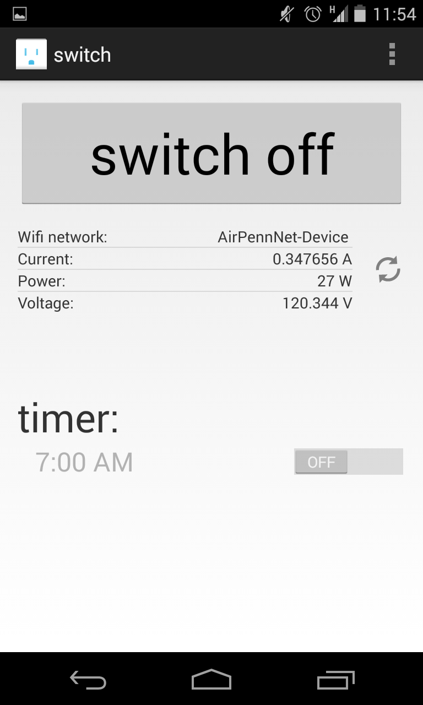

switch app
======================

Android client for an Electric Imp-powered plugtop device.

Building and Configuration
-----

### Building with Android Studio/Gradle

1. If you haven't already, install Android Studio from https://developer.android.com/sdk/installing/studio.html and the Android SDK tools from the 
"Get the SDK for an Existing IDE" section of https://developer.android.com/sdk/index.html.
2. Using the [Android SDK Manager](https://developer.android.com/sdk/installing/adding-packages.html), ensure you have the following packages:
	* SDK Version 21
	* Android Support Repository
	* Android Support Library
	* The latest version of Google Play Services
	* Google Repository
3. Download and import the switch project into Android Studio.  The Gradle build system will automatically download and import the following dependencies:
	* [Android Async HTTP](http://loopj.com/android-async-http/)
	* [Android BetterPickers](https://github.com/derekbrameyer/android-betterpickers)

### Required Configuration

#### Google Cloud Messenger
[Google Cloud Messenger](https://developer.android.com/google/gcm/gcm.html) (GCM) must be configured for communication between the app and plugtop.  If you have not already, follow the GCM "Getting Started" [instructions](https://developer.android.com/google/gcm/gs.html) and record both the project number and API key.

In [api-keys.xml](app/src/main/res/values/api-keys.xml), replace the string "PUT_SENDER_ID_HERE" with your GCM project number.

#### plugtop Agent ID
If you have not already, make sure your plugtop device has been programming and configured with the API key recorded in the Google Cloud Messenger section by following the [cloud and device setup instructions](README-SETUP-CLOUD.md).  Take note of the Agent ID found in this section.

Once the app is compiled and running on your device, click the menu icon in the upper right-hand corner of the screen.  Select "Settings" and enter the agent ID in the dialog that appears.

The app will now be fully functional.

App Usage
-----

### Switch and Meter Readout
At the top of the screen is a large switch button that can be used to switch the outlet on and off.

If the app has successfully connected to the outlet, a list of statistics from the device will be displayed below.  This list includes the name of the Wi-Fi network the device is connected to as well as current, power, and voltage readings from an internal meter.  It will automatically refresh while the outlet is switched on, but the button on the right can force an update.

### Timed Switcher
Near the bottom of the screen is a section labeled "timer".  Tap on the time display to set a alarm and the app will switch the outlet at that time.

Widget Usage
-----

When added to the home screen, the switch widget will indicate the status of the outlet and toggle its state.

Known Issues
----
* Occasional loss of plugtop state when reconnecting to the internet

License
----
This project is licensed under the terms of the [MIT license](LICENSE.txt).
